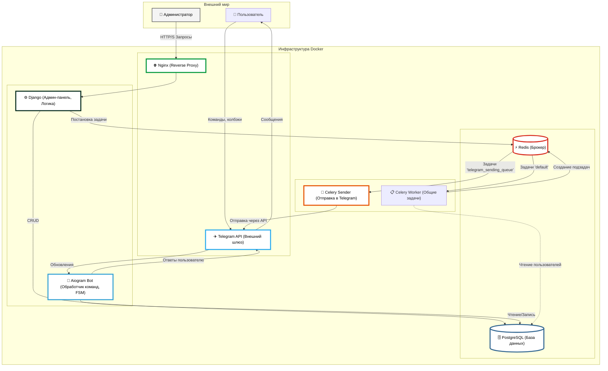

```markdown
# Проект Telegram-бота с Django Админ-панелью и Celery

Это проект Telegram-бота, интегрированного с Django для администрирования и использующего Celery 
для обработки фоновых задач, таких как рассылки.
```

```markdown
## Особенности

*   **Telegram Бот:**
    *   Взаимодействие с пользователями через команды и inline-кнопки.
    *   Реализованы "сцены" (FSM) для пошагового взаимодействия (главное меню, каталог, корзина, FAQ).
    *   Пагинация для отображения каталога, FAQ и товаров в корзине.
    *   Возможность добавления товаров в корзину, указания количества, просмотра и удаления товаров из корзины.
    *   Оформление заказа с возможностью тестовой оплаты (через `provider_token`).
    *   Проверка подписки на обязательные каналы (реализовано через middleware).
    *   Регистрация/обновление данных пользователя в БД при старте.
*   **Django Админ-панель:**
    *   Управление пользователями Telegram, категориями товаров, товарами, заказами, записями FAQ.
    *   Создание и управление рассылками сообщений пользователям бота (немедленная и отложенная отправка).
    *   Экспорт заказов в CSV, Excel и другие форматы (через `django-import-export`).
    *   Управление каналами для обязательной подписки.
*   **Celery Воркеры:**
    *   Отдельный воркер для общих задач Django (`celery`, `default` очереди).
    *   Отдельный воркер для отправки сообщений Telegram (`telegram_sending_queue`), используемый для рассылок.
*   **Технологии:**
    *   Python 3.13
    *   Django
    *   Aiogram 3.x (для Telegram-бота)
    *   Celery (для фоновых задач)
    *   PostgreSQL (база данных)
    *   Redis (брокер сообщений для Celery и бэкенд результатов)
    *   Nginx (веб-сервер и обратный прокси)
    *   Docker и Docker Compose (контейнеризация и оркестрация)
    *   Poetry (управление зависимостями)

## Структура проекта (ключевые директории)

*   `.`
    *   `docker-compose.yml`: Файл конфигурации Docker Compose для запуска всех сервисов.
    *   `Dockerfile.*`: Docker-файлы для сборки образов Django, Celery и бота.
    *   `docker-entrypoint.sh`: Скрипт точки входа для Django-контейнера (миграции, сбор статики, запуск Gunicorn).
    *   `nginx_config/`: Конфигурация Nginx.
    *   `pyproject.toml`, `poetry.lock`: Файлы управления зависимостями Poetry.
    *   `src/`: Исходный код проекта.
        *   `admin_panel/`: Приложение Django.
            *   `clients/`: Модуль Django с моделями, админкой, задачами Celery для рассылок.
            *   `merchandise_store/`: Основные настройки Django проекта (settings, urls, wsgi, asgi, celery).
            *   `manage.py`: Утилита управления Django.
            *   `config.py`: Pydantic-конфигурация для загрузки переменных окружения.
        *   `bot/`: Код Telegram-бота.
            *   `handlers/`: Обработчики сообщений и колбэков.
            *   `kbd/`: Функции для создания клавиатур.
            *   `main.py`: Точка входа для запуска бота.
            *   `middlewares.py`: Middleware для бота (например, проверка подписки).
            *   `misc/`: Вспомогательные утилиты (пагинатор, отправка сообщений).
            *   `tasks.py`: Задачи Celery для бота (например, отправка одного сообщения).
            *   `config.py`: Pydantic-конфигурация для бота (загружается из `admin_panel.config`).
    *   `logs/`: Директория для лог-файлов (создается автоматически, если настроено логирование в файлы).
    *   `mediafiles/`: Директория для загружаемых медиа-файлов (например, изображения товаров).
    *   `staticfiles_collected/`: Директория для собранных статических файлов Django.

## Предварительные требования

*   Docker: [Инструкция по установке](https://docs.docker.com/get-docker/)
*   Docker Compose: [Инструкция по установке](https://docs.docker.com/compose/install/)

## Настройка и запуск

1.  **Клонировать репозиторий:**
    ```bash
    git clone <URL_репозитория>
    cd <имя_папки_проекта>
    ```

2.  **Создать файл окружения `.env`:**
    В корневой директории проекта создайте файл `.env` и заполните его необходимыми значениями. Пример содержания:

    ```env
    # PostgreSQL Settings
    POSTGRES_DB=mydatabase
    POSTGRES_USER=myuser
    POSTGRES_PASSWORD=mypassword

    # Django Settings
    DJANGO_KEY='your_django_secret_key_here' # Сгенерируйте надежный ключ
    DJANGO_DEBUG=True # или False для продакшена

    # Telegram Bot Settings
    BOT_TOKEN='your_telegram_bot_token_here'

    # Настройки для Celery и Redis (обычно не требуют изменения, если Redis запускается локально через Docker)
    # CELERY_BROKER_URL=redis://redis:6379/0
    # CELERY_RESULT_BACKEND=redis://redis:6379/1
    ```
    *   `POSTGRES_DB`, `POSTGRES_USER`, `POSTGRES_PASSWORD`: Учетные данные для базы данных PostgreSQL.
    *   `DJANGO_KEY`: Секретный ключ Django. Можно сгенерировать, например, с помощью `python -c 'from django.core.management.utils import get_random_secret_key; print(get_random_secret_key())'`.
    *   `DJANGO_DEBUG`: Режим отладки Django (`True` для разработки, `False` для продакшена).
    *   `BOT_TOKEN`: Токен вашего Telegram-бота, полученный от @BotFather.

3.  **Сборка Docker-образов:**
    Эта команда соберет образы для всех сервисов, определенных в `docker-compose.yml`.
    ```bash
    docker-compose build
    ```

4.  **Запуск сервисов:**
    Эта команда запустит все сервисы в фоновом режиме (`-d`).
    ```bash
    docker-compose up -d
    ```
    При первом запуске `docker-entrypoint.sh` автоматически выполнит:
    *   Применение миграций Django (`makemigrations clients`, `migrate`).
    *   Сбор статических файлов (`collectstatic`).
    *   Запуск Gunicorn для Django.

5.  **Создание суперпользователя Django (для доступа к админ-панели):**
    Выполните эту команду после того, как контейнер `django` будет запущен:
    ```bash
    docker-compose exec django python src/admin_panel/manage.py createsuperuser
    ```
    Следуйте инструкциям для создания имени пользователя, email и пароля.

## Доступ к сервисам

*   **Django Админ-панель:** Откройте в браузере `http://localhost:8000/admin/` (порт Nginx `80` маппится на `8000` хоста, а Nginx проксирует на Django `8000` внутри контейнера). Войдите, используя учетные данные суперпользователя, созданные на предыдущем шаге.
*   **Telegram Бот:** Найдите вашего бота в Telegram по его имени (username) и начните с ним взаимодействовать. Команда `/start` для регистрации, `/menu` для вызова главного меню.

## Основные команды Docker Compose

*   **Запустить все сервисы:**
    ```bash
    docker-compose up -d
    ```
*   **Остановить все сервисы:**
    ```bash
    docker-compose down
    ```
*   **Пересобрать образы и запустить:**
    ```bash
    docker-compose up -d --build
    ```
*   **Посмотреть логи конкретного сервиса (например, `django` или `bot_runner`):**
    ```bash
    docker-compose logs -f django
    docker-compose logs -f bot_runner
    ```
*   **Выполнить команду внутри контейнера (например, Django manage.py):**
    ```bash
    docker-compose exec django python src/admin_panel/manage.py <команда_django>
    # Например:
    # docker-compose exec django python src/admin_panel/manage.py shell
    ```

## Управление Django

Команды `manage.py` выполняются внутри контейнера `django`:

*   **Создание миграций для приложения `clients` (если модели изменились):**
    ```bash
    docker-compose exec django python src/admin_panel/manage.py makemigrations clients
    ```
*   **Применение миграций:**
    ```bash
    docker-compose exec django python src/admin_panel/manage.py migrate
    ```
    (Обычно выполняется автоматически при старте контейнера `django`)
*   **Сбор статических файлов:**
    ```bash
    docker-compose exec django python src/admin_panel/manage.py collectstatic --noinput
    ```
    (Обычно выполняется автоматически при старте контейнера `django`)

## Ключевые операции в админ-панели

### Рассылки сообщений

1.  **Создание рассылки:**
    *   Перейдите в раздел "Рассылки" (`Broadcasts`).
    *   Нажмите "Добавить рассылку".
    *   Заполните "Текст сообщения для рассылки".
    *   **Для немедленной отправки:** Оставьте статус "Черновик" (`Draft`) и не указывайте "Время отправки".
    *   **Для отложенной отправки:** Установите "Время отправки" (`Scheduled at`) и измените статус на "Запланирована" (`Scheduled`).
    *   Сохраните рассылку.

2.  **Запуск рассылки:**
    *   Перейдите в раздел "Пользователи Telegram" (`Telegram users`).
    *   Выберите пользователей, которым хотите отправить рассылку (если это применимо к выбранному типу рассылки).
    *   В выпадающем меню "Действие" (`Action`) выберите:
        *   **"Отправить запланированную рассылку"**: Это действие обработает **все** рассылки со статусом "Запланирована" и отправит их **выбранным** пользователям. Задачи будут поставлены в очередь Celery.
        *   **"Отправить выбранные рассылки немедленно"**: Это действие обработает **все** рассылки со статусом "Черновик" и немедленно отправит их **всем** пользователям в базе данных (не только выбранным).
    *   Нажмите "Выполнить".

    **Важно:** Обратите внимание на поведение действий. "Отправить запланированную рассылку" учитывает выбранных пользователей, тогда как "Отправить выбранные рассылки немедленно" (для черновиков) рассылает всем пользователям, игнорируя выбор.

### Экспорт заказов

1.  Перейдите в раздел "Заказы" (`Orders`) в админ-панели.
2.  Над списком заказов будет доступна кнопка "Экспорт".
3.  Нажмите "Экспорт". Вам будет предложено выбрать формат файла (например, CSV, Excel) и, возможно, другие параметры.
4.  После выбора параметров файл будет сгенерирован и загружен.

## Celery Воркеры

В `docker-compose.yml` определены два Celery воркера:

1.  `celery_worker_django`:
    *   Команда: `celery -A admin_panel.merchandise_store.celery worker -l INFO -Q celery,default --concurrency=2 --hostname=celery_django@%h`
    *   Обрабатывает задачи из очередей `celery` и `default`.
    *   Используется для общих задач Django, например, для обработки частей рассылки (`send_broadcast_chunk_task`).
2.  `bot_sender_worker`:
    *   Команда: `celery -A admin_panel.merchandise_store.celery worker -l INFO -Q telegram_sending_queue --concurrency=2 --hostname=bot_sender@%h`
    *   Обрабатывает задачи из очереди `telegram_sending_queue`.
    *   Используется для непосредственной отправки сообщений через Telegram API (`send_single_telegram_message_task`).

Логи воркеров можно посмотреть с помощью:
```bash
docker-compose logs -f celery_worker_django
docker-compose logs -f bot_sender_worker
```

## Логирование

Логи контейнеров Django, Celery и бота по умолчанию направляются в `stdout` и `stderr` контейнеров, а также в файлы внутри директории `/app/logs` в контейнерах. Эта директория смонтирована на хост-машину через volume `django_logs`, так что логи будут сохраняться в Docker volume.
Логи Nginx сохраняются в volume `nginx_logs`.

## Остановка проекта

Чтобы остановить все запущенные сервисы и удалить контейнеры:
```bash
docker-compose down
```
Если вы хотите также удалить volumes (ВНИМАНИЕ: это удалит данные PostgreSQL, Redis, логи):
```bash
docker-compose down -v
```
